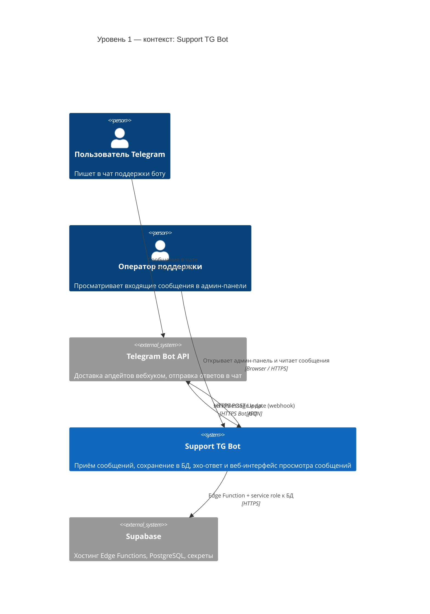

# C4 — уровень 1: контекст системы (System Context)

Показывает систему в окружении: пользователи, внешние сервисы.

Формат: [Mermaid C4](https://mermaid.js.org/syntax/c4.html). Рендер: GitHub, GitLab, VS Code (Mermaid).

