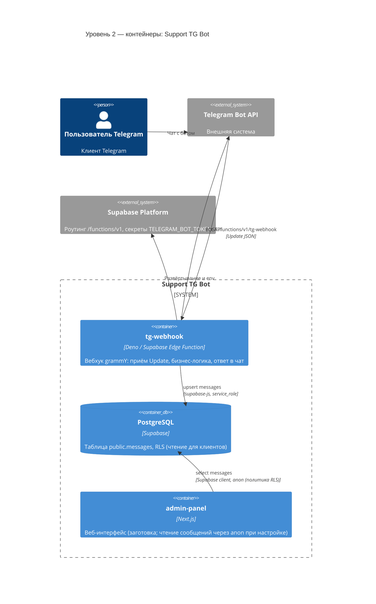

# C4 — уровень 2: контейнеры (Container)

Показывает основные приложения и хранилища внутри границы системы и их технологии.

Формат: [Mermaid C4](https://mermaid.js.org/syntax/c4.html).

**Замечание:** **admin-panel** в репозитории — заготовка Next.js; на диаграмме отражена как планируемый потребитель read-only доступа к БД.
