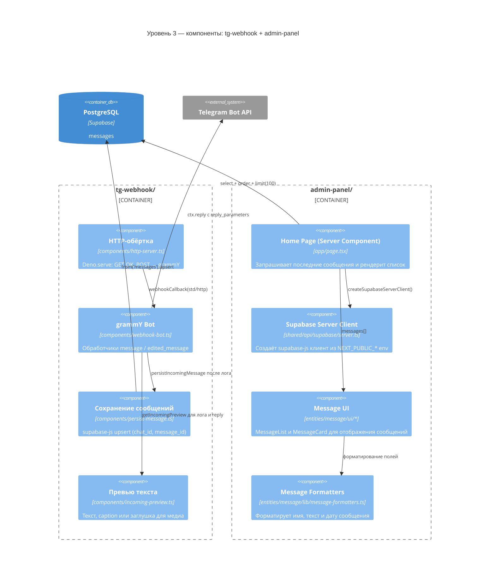

# C4 — уровень 3: компоненты (Component)

Детализация контейнеров **tg-webhook** и **admin-panel**: внутренние части и зависимости.

Формат: [Mermaid C4](https://mermaid.js.org/syntax/c4.html).

```mermaid
C4Component
title Уровень 3 — компоненты: tg-webhook + admin-panel

Container_Boundary(webhook, "tg-webhook/") {
  Component(http, "HTTP-обёртка", "components/http-server.ts", "Deno.serve: GET OK, POST → grammY")
  Component(bot, "grammY Bot", "components/webhook-bot.ts", "Обработчики message / edited_message")
  Component(persist, "Сохранение сообщений", "components/persist-message.ts", "supabase-js upsert (chat_id, message_id)")
  Component(preview, "Превью текста", "components/incoming-preview.ts", "Текст, caption или заглушка для медиа")
}

Container_Boundary(admin, "admin-panel/") {
  Component(page, "Home Page (Server Component)", "app/page.tsx", "Запрашивает последние сообщения и рендерит список")
  Component(sb, "Supabase Server Client", "shared/api/supabase/server.ts", "Создаёт supabase-js клиент из NEXT_PUBLIC_* env")
  Component(list, "Message UI", "entities/message/ui/*", "MessageList и MessageCard для отображения сообщений")
  Component(fmt, "Message Formatters", "entities/message/lib/message-formatters.ts", "Форматирует имя, текст и дату сообщения")
}

ContainerDb(db, "PostgreSQL", "Supabase", "messages")

System_Ext(telegram, "Telegram Bot API")

Rel(http, bot, "webhookCallback(std/http)")
Rel(bot, persist, "persistIncomingMessage после лога")
Rel(bot, preview, "getIncomingPreview для лога и reply")
Rel(bot, telegram, "ctx.reply с reply_parameters")
Rel(persist, db, "from('messages').upsert")
Rel(page, sb, "createSupabaseServerClient()")
Rel(page, db, "select + order + limit(100)")
Rel(page, list, "messages[]")
Rel(list, fmt, "форматирование полей")
```
