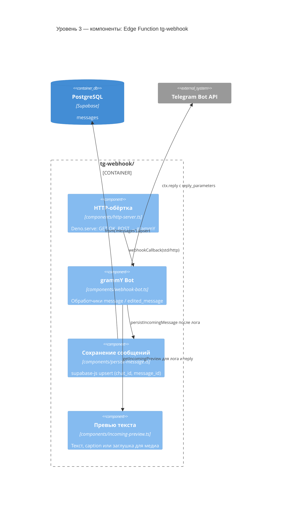

# C4 — уровень 3: компоненты (Component)

Детализация контейнера **tg-webhook**: внутренние части и зависимости.

Формат: [Mermaid C4](https://mermaid.js.org/syntax/c4.html).

```mermaid
C4Component
title Уровень 3 — компоненты: Edge Function tg-webhook

Container_Boundary(webhook, "tg-webhook/") {
  Component(http, "HTTP-обёртка", "components/http-server.ts", "Deno.serve: GET OK, POST → grammY")
  Component(bot, "grammY Bot", "components/webhook-bot.ts", "Обработчики message / edited_message")
  Component(persist, "Сохранение сообщений", "components/persist-message.ts", "supabase-js upsert (chat_id, message_id)")
  Component(preview, "Превью текста", "components/incoming-preview.ts", "Текст, caption или заглушка для медиа")
}

ContainerDb(db, "PostgreSQL", "Supabase", "messages")

System_Ext(telegram, "Telegram Bot API")

Rel(http, bot, "webhookCallback(std/http)")
Rel(bot, persist, "persistIncomingMessage после лога")
Rel(bot, preview, "getIncomingPreview для лога и reply")
Rel(bot, telegram, "ctx.reply с reply_parameters")
Rel(persist, db, "from('messages').upsert")
```
