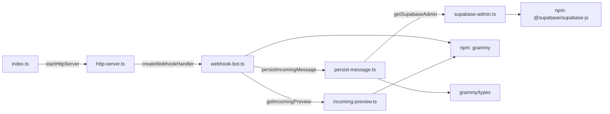
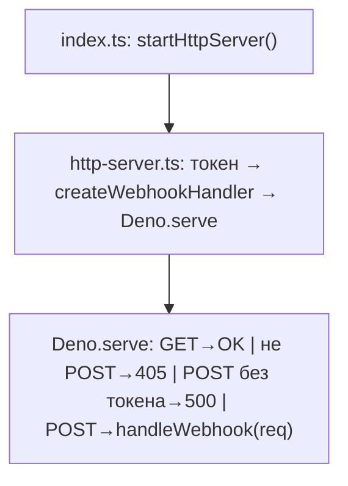
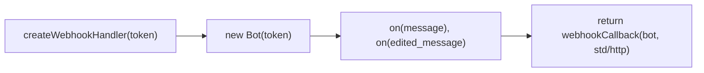
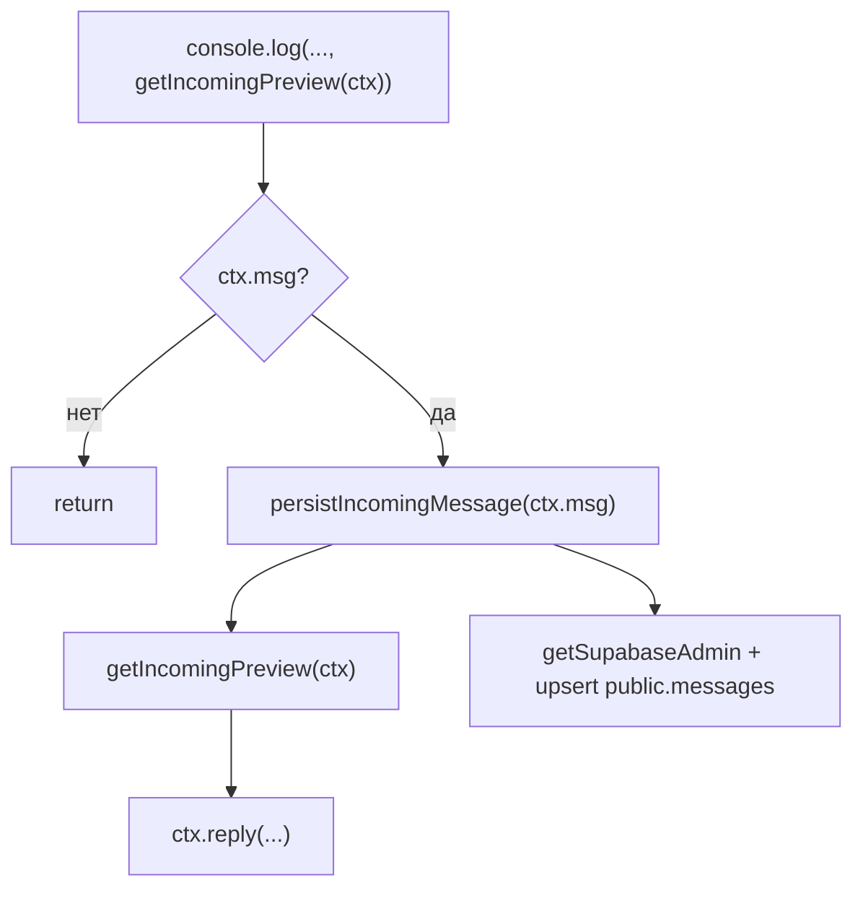

# C4 — уровень 4: код (Code)

Соответствует текущему коду в `supabase/functions/tg-webhook/`.

## Важно

Этот уровень описывает код контейнера `tg-webhook`. Для админ-панели (`admin-panel`) детализация компонентов вынесена в `c4-level3-component.md`.

## Файлы и импорты (как в коде)

| Файл | Импортирует |
|------|-------------|
| `index.ts` | `./components/http-server.ts` → `startHttpServer` |
| `components/http-server.ts` | `./webhook-bot.ts` → `createWebhookHandler` |
| `components/webhook-bot.ts` | `grammy` (`Bot`, `Context`, `webhookCallback`), `./incoming-preview.ts` → `getIncomingPreview`, `./persist-message.ts` → `persistIncomingMessage` |
| `components/incoming-preview.ts` | `grammy` → тип `Context` |
| `components/persist-message.ts` | `grammy/types` → тип `Message`, `./supabase-admin.ts` → `getSupabaseAdmin` |
| `components/supabase-admin.ts` | `@supabase/supabase-js` → `createClient`, `SupabaseClient` |

*(Пути в репозитории: все файлы под `supabase/functions/tg-webhook/`, модули вебхука — в `components/`.)*

## Загрузка (выполняется при старте функции)

1. **`index.ts`**: вызывается `startHttpServer()`.
2. **`startHttpServer`** (`http-server.ts`): читает `TELEGRAM_BOT_TOKEN`; если токен есть — `handleWebhook = createWebhookHandler(token)`, иначе `null`.
3. **`createWebhookHandler`** (`webhook-bot.ts`): создаёт `Bot`, вешает `onMessage` и `edited_message` на общий обработчик `onMessageOrEdited`, возвращает **`webhookCallback(bot, "std/http")`** — это и есть функция, которую потом передают в HTTP-слой как обработчик POST.
4. **`startHttpServer`** регистрирует **`Deno.serve`** с колбэком: GET → `"OK"`; не POST → 405; POST без `handleWebhook` → 500 JSON; POST иначе → `await handleWebhook(req)` в `try/catch` (ошибка → 400 JSON).

## Обработка одного POST (Update от Telegram)

Порядок в **`onMessageOrEdited`** (`webhook-bot.ts`):

1. Собирается подпись отправителя для лога, вызывается **`getIncomingPreview(ctx)`** — в **`console.log`**.
2. Если **`!ctx.msg`** — выход без ответа и без сохранения.
3. **`await persistIncomingMessage(ctx.msg)`** — внутри **`getSupabaseAdmin()`**, затем **`db.from("messages").upsert(..., onConflict: "chat_id,message_id")`**.
4. Снова **`getIncomingPreview(ctx)`** для текста ответа.
5. **`ctx.reply(..., { reply_parameters: { message_id } })`** — ответ в Telegram.

### Загрузка и HTTP-слой

### Цепочка `createWebhookHandler`

### Обработчик апдейта (после разбора grammY)

## Символы и роли

| Символ | Где объявлен | Роль |
|--------|----------------|------|
| `startHttpServer` | `components/http-server.ts` | Токен, `createWebhookHandler`, `Deno.serve`, маршрутизация GET/POST/ошибки |
| `createWebhookHandler` | `components/webhook-bot.ts` | `Bot`, подписки, возврат `webhookCallback(..., "std/http")` |
| `onMessageOrEdited` | `components/webhook-bot.ts` (внутренняя функция) | Лог, превью, `persist`, ответ |
| `getIncomingPreview` | `components/incoming-preview.ts` | Текст/подпись/заглушка из `ctx.msg` |
| `persistIncomingMessage` | `components/persist-message.ts` | Строка для `messages`, `upsert` |
| `getSupabaseAdmin` | `components/supabase-admin.ts` | Один раз `createClient` (service role) |

## Замечания по безопасности и данным

- **RLS**: политика `Allow public read` на `messages` рассчитана на клиентов с anon key (например, админка); запись из Edge Function идёт через **service_role** (RLS на неё не действует).
